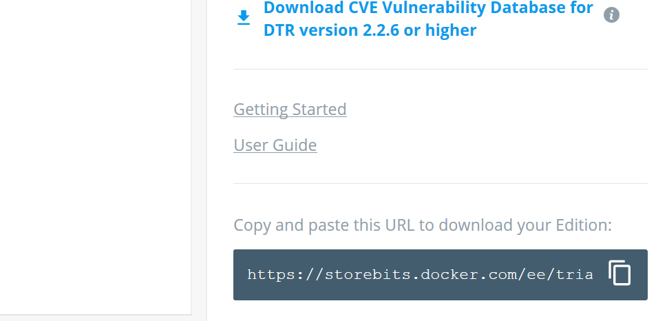

## Docker EE
1. Visit docker.com 
    Goto Products > Docker Enterprise > Start Free Trial
        Fill in the information > Submit

2.  Create new Ubuntu VM Using Azure portal in same resource group
3.  Connect VM using SSH client (Git Bash or Ubuntu bash on Windows 10 or Putty)
4.  Visit URL for Steps to Install Docker EE on Linux

    https://docs.docker.com/install/linux/docker-ee/ubuntu/ 

    https://docs.docker.com/install/linux/docker-ee/centos/

    https://docs.docker.com/install/linux/docker-ee/rhel/
    
5.  You need Docker EE package repository URL to download and install docker-ee
    Get that URL from    https://hub.docker.com/my-content

    Repository URL should be at lower right corner of page
    

6.  Follow the steps at page from step 4 and install docker ee