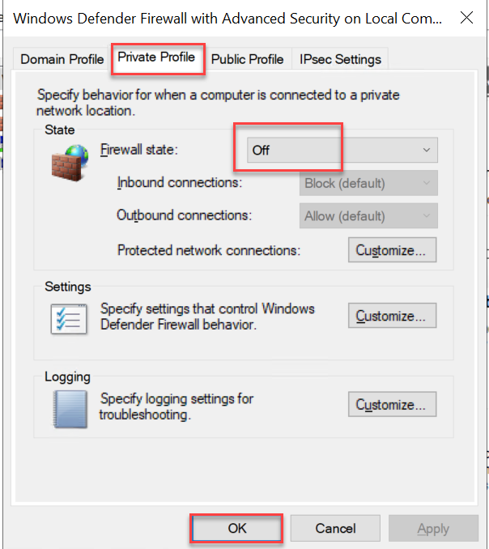

1. Create TWO Azure VMs in same Virtual Network
2. Create Remote Desktop session for VM1
    Start > Windows Defender Firewall > Windows Defender Firewall Properties
        Select TAB "Private Profile" > Change Firewall state to OFF

    
3.  Create Remote Desktop session for VM2
     Repeate the Step #2

4.  Switch to VM1 RDP Session, and open command prompt and use following command:
    ```
    $ ipconfig 
    ```

    The First IP Address should be something like "10.0.0.4"

5.  Initialize Swarm cluster (Using IP Captured in last step) 

    ```pwsh
    $ docker swarm init --advertise-addr 10.0.0.4 --default-addr-pool 182.18.0.0/24
    ```

    Once command is executed, it should generate a token for Worker nodes
    Copy the command generated by swarm init and use it on another VM1
    Your token should look like :

    ```pwsh
    docker swarm join --token SWMTKN-1-4fcos1nttb7urbjon7x5soqeyqdtaozzc1p24i2qtuygycklpg-1qf0p3jffk9qnkh4h1zokh08d 10.0.0.4:2377
    ```

6.  Switch to RDP Session of VM2 and open command prompt:
    Paste the command copied from VM1
    
    ```pwsh
    $ docker swarm join --token SWMTKN-1-4fcos1nttb7urbjon7x5soqeyqdtaozzc1p24i2qtuygycklpg-1qf0p3jffk9qnkh4h1zokh08d 10.0.0.4:237
    ```

7.  Use "Docker info" to verify the swarm status
