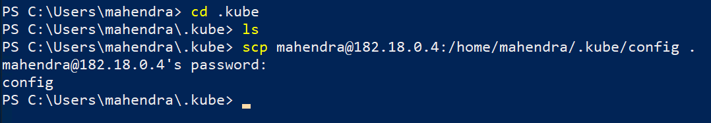
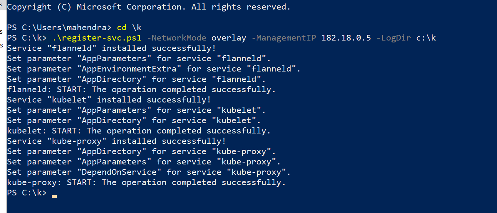

## Setting up Kubernetes Cluster

### https://kubernetes.io/docs/setup/production-environment/tools/kubeadm/install-kubeadm

1. Create Resource Group 

    ```
    Name: k8s-Cluster
    Location: Southeast asia
    ```

2. Create Virtual Network

    Create Resource > Networking > Virtual Network
    ```
    Network Name   cluster-Net
    IP Range       182.18.0.0/16
    Resource group k8s-cluster
    Subnet         182.18.0.0/24
    ```

3.  Create new VM 

    ```
    VM Name:    master1
    Ports:      SSH (22)
    Username:   mahendra
    Password:   <Password>
    Network:    cluster-net
    OS Disk:    Standard HDD (To Save cost!)
    ```

4.  Once VM is Provisioned, Connect using Putty or Git Bash

5.  Install Container Runtime : Docker
    ```bash
    $ sudo apt update -y
    $ sudo apt install docker.io -y
    ## Add current user to 'docker' user group
    ## to avoid using 'sudo' prefix for every docker cli command
    ## You need to reconnect your remote session (No need for VM Restart!)
    $ sudo usermod -aG docker $USER
    ```

6.  Install Kubernetes from official repositories
    
    ```bash
    ## Switch to ROOT user for Installation
    sudo -i
    ## Install GPG Key (Encryption key) to VALIDATE kubernetes repository packages
    apt-get update && apt-get install -y apt-transport-https curl
    ## Add kubernetes repo URL in System package manager
    curl -s https://packages.cloud.google.com/apt/doc/apt-key.gpg | apt-key add -
    cat <<EOF >/etc/apt/sources.list.d/kubernetes.list
    deb https://apt.kubernetes.io/ kubernetes-xenial main
    EOF
    ## Update packages (Read Package repository URLS and download files)
    apt-get update
    ## Install the files downloaded by previous command
    apt-get install -y kubelet kubeadm kubectl
    ## Freez the package versions (To Avoid auto-update of these packages)
    apt-mark hold kubelet kubeadm kubectl
    ## Exit from ROOT user
    exit
    ```

7.  Set docker daemon to start on OS Boot
    ```bash
    $ sudo systemctl enable docker
    ```

8.  Bootstrap a cluster (Wait for cluster to be ready)
    ```bash
    $ sudo kubeadm init --pod-network-cidr=10.244.0.0/16
    ```

    Command should generate TOKEN for adding worker nodes.

9.  Copy the kubeconfig from ROOT folder to USER'S home folder

    ```bash
    mkdir -p $HOME/.kube                                                         sudo cp -i /etc/kubernetes/admin.conf $HOME/.kube/config                     sudo chown $(id -u):$(id -g) $HOME/.kube/config 
    ```

10. Test the cluster using kubectl

    ```bash
    $ kubectl get nodes
    ```

    NOTE: Your nodes are NOT READY, you need to install CNI Network plugin.

11. Install the Network plugin 

    Ref: [Kubernetes Docs](https://kubernetes.io/docs/setup/production-environment/tools/kubeadm/create-cluster-kubeadm/)
    
    ```bash
    ## Default firewall (iptables) would block the the packets
    ## Unblock using following command
    $ sudo sysctl net.bridge.bridge-nf-call-iptables=1
    ```

12. Click [here](./kube-flannel.yml) for the modified flannel deployment file.

    To download this file on ubuntu VM, and begin deployment try following command:
    ```bash
    $ wget https://raw.githubusercontent.com/mahendra-shinde/docker-k8s-july-2019/master/k8s-with-windows-workers/kube-flannel.yml 
    
    $ kubectl apply -f kube-flannel.yml
    
    # Check the nodes
    $ kubectl get nodes
    ```

### Phase II  : Adding Windows Worker nodes

1.  Create a new `Windows Server 2019 Datacenter with Containers` VM. in same resource group as the Ubuntu (Master) VM.

2.  Download the necessary kubernetes binaries from URL:

    https://dl.k8s.io/v1.15.0/kubernetes-node-windows-amd64.tar.gz 

    > The above url would allow you to download k8s api version 1.15.1
      In case URL is inaccessible, try visiting [this](https://github.com/kubernetes/kubernetes/blob/master/CHANGELOG-1.15.md#v1151) page.

3.  Extract the contents of downloaded file.
4.  Connect to Windows Server VM using RDP and copy all extracted files inside your Windows VM (Create a folder: c:\k as target for files).

5.   Now From powershell prompt run following commands to download kube config file
   
    ```bash
    $ cd c:/k
    $ scp mahendra@182.18.0.4:/home/mahendra/.kube/config . 
    ```

> Please replace `mahendra` with your user-name in all above commands.

6.  Now run following commands to install flannel on windows

    ```pwsh
    $ cd c:\k
    $ [Net.ServicePointManager]::SecurityProtocol = [Net.SecurityProtocolType]::Tls12
    $ wget https://raw.githubusercontent.com/Microsoft/SDN/master/Kubernetes/flannel/start.ps1 -o c:\k8s\start.ps1
    $ .\start.ps1 -ManagementIP 182.18.0.5 -NetworkMode overlay -InterfaceName "Ethernet 2"  -LogDir c:\k
    ```

7.  Now, once the process is finished, go back to Ubuntu (Master) VM to Check node list

    ```bash
    $ kubectl get nodes
    ```
    Is your Windows node listed as `NotReady` ? Do next step.

8.  Download the script to register `kubelet.exe` and `kube-proxy.exe` as windows services
    from [here](./register-svc.ps1). Download one more tool (nssm) from [here](https://nssm.cc/release/nssm-2.24.zip).

    nssm-2.24.zip contains nssm.exe inside win64 folder, please copy this file to c:\k folder.

    ```pwsh
    $ cd c:\k
    $ C:\k\register-svc.ps1 -NetworkMode overlay -ManagementIP 182.18.0.5 -LogDir c:\k
    ```
    